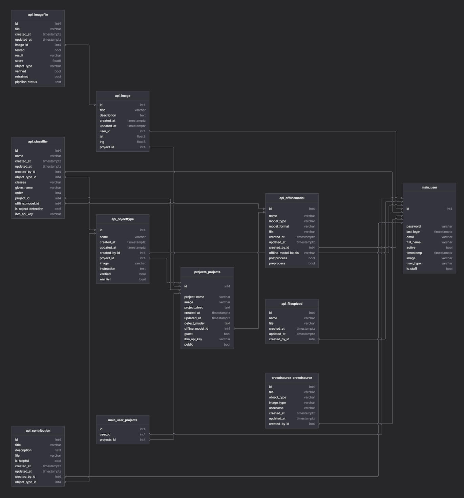
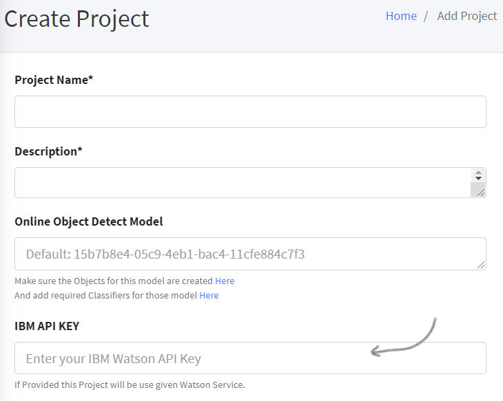
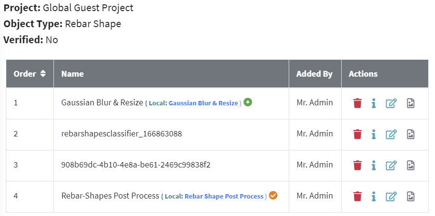
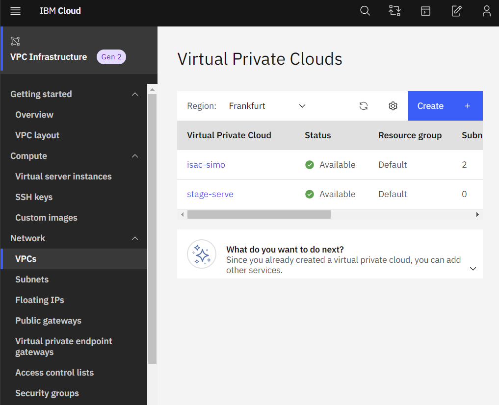

##Introduction

Intelligent Supervision Assistant for Construction - Sistema Inteligente de Monitoreo de Obra
ISAC-SIMO is a system to validate that the intervention work done for homeowners has been done correctly and safely. It is a Build Change project supported by a grant from IBM.

###BEFORE YOU START
Before starting the project, you need to set these requirements.

 - Python > 3.7.x
 - PostgreSQL > 13.x
 
##Installation
View the Open-Source GitHub repository for **ISAC-SIMO Django Backend**.
First Clone this Project in a suitable directory & Change to project directory.

```bash
git clone https://github.com/Call-for-Code/ISAC-SIMO-Django-Backend.git
```
```bash
cd ISAC-SIMO-Django-Backend
```
Although **not required**, for the Development Environment in Linux / MacOS, it is recommended to set up a virtual environment. **For Windows users, we suggest working without virtual env**.

```bash
virtualenv -p python env
```
```bash
source env/bin/activate
```
Now, inside the Project Root (either virtualenv or not) install all required packages using:
```bash
pip install -r requirements.txt
```
It will install all required packages and libraries. It might take some time.
(You might have noticed Pipfile used by pipenv, ignore that for the time being.)

There are furthermore packages that are required to be installed. The versions of these packages must be compatible with your systems Python version. So, you might need to verify and install them manually.
**Example**: tensorflow might not have released their package for the Python version or the OS you are using, so you might need to verify this and install appropriate versions or update the Python itself.

These are the Packages, that you need to verify: [psycopg2](https://pypi.org/project/psycopg2/), [tensorflow](https://www.tensorflow.org/)

You can use `python manage.py` check to verify if they run successfully or not.
##Configuration
You will need to set up a `.env` file with required configurations before starting the application. First, make a copy of `.env.example`
```bash
cp .env.example .env
```
*Change cp to copy for windows*

Modify the `.env` file as required

- ENV = “local” or “production” (Debug is only enabled in local environment by default)
- SECRET_KEY = Generate a key with https://djecrety.ir/
- DATABASE_URL = You can either modify isac_simo/database_settings.py file or override it by providing database url here. Make sure you have created the database successfully.
- IBM_API_KEY = Watson API Key to use by default (i.e. if not provided in any project / classifiers)
- IBM_BUCKET_ENDPOINT = IBM COS Endpoint
- IBM_BUCKET = COS Bucket Name
- IBM_BUCKET_TOKEN = COS Key/Token
- IBM_BUCKET_CRN = COS Bucket CRN
- PROJECT_FOLDER = Specify the Relative Path to Project Folder (e.g. /home/username/isac). Do not end the path with closing front or back slash ('/' or '\')
- MAINTENANCE = Enable or Disable Maintenance Mode
- PASSWORD = A Secret Password used for Webhook Requests
- GOOGLE_MAP_STREET_API = API Key for Google Map Street Views
- GOOGLE_MAP_API = API Key for Google Map Web
- CACHE_LOCATION = Relative Path to Store Cache, And also used to Sync Data between Threads (e.g. /var/tmp/django_cache Make sure the Path exists)

##Migrating & Running
Now, if the environment is set up properly, you can migrate the tables to your database.
```bash
python manage.py migrate
```
And, Create a Super-User to get started.
```bash
python manage.py createsuperuser
```
Now, start the Application with:
```bash
python manage.py runserver
```
And visit [http://127.0.0.1:8000/](http://127.0.0.1:8000/) in any modern browsers to open the application.

**Note**: **/static/** and **/media/** are the static files and media files location respectively.
##Database


*Above is a rough Database Table Relationship Diagram.*

The Tables and their purpose are described below. Here, Django Model is representing respective tables and all available Columns and Getters can be viewed in Django Model Files.

- **User**: Stores the users themselves, their information and user type. It is used to Login users. User Types can be any of "user", "engineer", “government", “project_admin", “admin".
- **Projects**: Stores Project Information along with guest & public boolean fields in it.
- **Image**: The tested images information like title, latitude, longitude, description, added by etc.
- **ImageFile**: Many-To-One Relation with Image Model, which stores the individual image data. The file location, result, score, pipeline, verified status etc. are some fields.
- **OfflineModel**: Stores the Offline/Local Models information and file location along with the model types, format, label etc.
- **ObjectType**: Stores Object information like name, instruction, image, wishlist & verified status along with link to chosen Project.
- **Classifier**: Stores all Classifier/Model information which includes linking of Offline Model, Watson Classifier, Watson Object Detection with specific Object Type. The Order column determines in which order the Classifier will run in the Pipeline (i.e. Pipeline of Same Object Type)
- **FileUpload**: Stores any other files (useful for Helper Models & Scripts) that can be uploaded.
- **Crowdsource**: Stores Images uploaded in Crowdsource by users with different information.
- **Contribution**: Stores Contribution files and information for specific Object Type of a Project

##Django Apps
The Installed Apps used in this project can be found inside **“main”**, **”projects”**, **“api”**, **“map”**, **“crowdsource”** directories. These apps have their own purposes. These directories contain their own templates, models, forms, serializers, urls, views etc.
The **“main”** app mostly handles User Model, Registration, Login and User Management by Admin.
The **“projects”** app handles Project Model and its CRUD, Public Projects & Contributions.
The **“map”** app handles Google Map Street View based image testing using a selected pipeline.
The **“crowdsource”** app handles Crowdsource Model, API and all of its controllers.
The **“api”** app is the largest among all, which handles all remaining models (Image, Image File, Object Type, Classifier, Offline Model, File Upload and Contribution). It contains all controllers, API serializers and views to handle all requests. It also contains a helpers.py file that handles all of Image Tests, Watson API Requests, Pipeline Recursion, running Detect Model, running Classifier, Offline Model tests, Image Processing, Testing Models (Quick Tests), Re-Training & Creating Watson Model and more.

### <span style="color:green">Files and their Uses:</span>
- `urls.py` - Handle routes for both web and api
- `views.py` - Controller for both web and api
- `forms.py` - Manages Django Web Forms
- `models.py` - Manages Models (Database Table Object)
- `serializers.py` - Manages api serializer for different models along with create, edit functions.
- `middleware.py` - Contains middleware handlers (like Maintenance Mode Detection etc.)
- `helpers.py` - Many helper functions like watson api call, offline model run, tests etc.
- `migrations/*` - Contains all Database Migrations.
- `templates/*.html` - Contains Django Web Templates & Master wrapper.

##Getting started with IBM Watson
You know that, with **ISAC-SIMO** you can create a model pipeline to test provided images. These models/classifiers can be local offline models like h5, python script etc. Or, you can also use IBM Watson Classifier and Object Detection Model, as in a lot of cases this can be convenient and even better. 
To create your own IBM Watson Classifiers and Object Detection Model, you should first register and create your account. Visit here to learn more about Watson [https://www.ibm.com/watson](https://www.ibm.com/watson)
After registering, you can create a new Watson Studio here, [https://cloud.ibm.com/catalog/services/watson-studio](https://cloud.ibm.com/catalog/services/watson-studio)

On Successful Watson Studio creation, you are able to access this page via Resource List.


The API Key can be copied and used in either `IBM_API_KEY` environment variable, Or users can also use this while Creating/Editing Project and Classifier Model



Clicking the **“Launch Watson Studio”** button you can open the Watson dashboard, where classifiers and object detection models can be created and trained. You can learn more about Watson from their documentation. After you have trained a new Model, you can use it in the ISAC-SIMO application. Just copy the “collection ID” or “classifier ID” and use it while creating the Pre-Trained Model. Then put the API Key as shown before. (You can also test Pre-Built Models)

ISAC-SIMO also allows you to create a Classifier from the app itself, which might be easier. Now, you should be able to create and use Watson models with **ISAC-SIMO** easily.

## How ISAC-SIMO Calls Watson Model
There are multiple ways to work with Watson via Python Script. ISAC-SIMO uses simple API requests attaching files and content to the request body.
 [Documentation Here](https://cloud.ibm.com/apidocs/visual-recognition/visual-recognition-v3#introduction)
Most of all API calls are handled by `api/helpers.py` file. It uses requests library to send header, data, files as required for the watson api.
As per the Model/Classifier added by **ISAC-SIMO** users, it can determine whether to call Watson API or run Pre/Post Processor or Python Scripts from the pipeline.


##How ISAC-SIMO Runs the Model Pipeline
As we know, different Object Types can have different pipelines of classifiers that are run when testing user uploaded images. When creating these classifiers/models for any object type, admin or project-admin can provide the order in which the model runs.



Programmatically, we use recursion techniques to run pipelines in order. The `api/helpers.py` file has a function named test_image which runs the test on uploaded images and recursively passes the model response to the next model in the pipeline.
If it is a preprocessor model, it sends the image and expects an image to be returned in opencv format. Similarly, postprocessors should return their own standard response. If the model is watson classifier or object detection then it is sent via api and parses the response as required. For More information refer to even more detailed [Documentation Here](https://www.docs.isac-simo.net/) which also shows examples of offline/local models.

##How tO Deploy & Manage ISAC-SIMO in a VPC (Basics)
This section only explains the basics, on how to deploy ISAC-SIMO Django Application to a fresh VPC.

### <span style="color:green">Create Virtual Private Cloud with IBM Cloud:</span>
You can get started with [IBM VPC Here](https://cloud.ibm.com/vpc-ext/overview)



From the VPCs tab, you can view and create new VPC for your server.
While creating a new VPC, you need to choose to enable SSH, Ping, choose an appropriate server, IP range and enable Public Gateway. Click on the recently clicked VPC and create Subnets for your server.


Now, you need to add your SSH Key so that you can shh to any VPC instance you will create. Using the SSH Keys tab you can manage ssh access.


Now, you can create a New Virtual Server Instance using the sidebar tab


When creating a new instance, choose an appropriate Operating System (Linux is preferable). Select the SSH key you added, choose desired Profile/Server Type and choose the VPC you created earlier. This should set up a new VPC Instance.
To ssh and access this instance from the web you need to create a floating IP and assign the VPC to it. From the Floating IPs sidebar tab you can create and manage [Floating ips](https://cloud.ibm.com/vpc-ext/network/floatingIPs).
Now, in the Virtual Server Instances page you should see Floating IP in the table.

You can then SSH to the server, using the Floating IP, ssh `xx.xx.xx.xx`
As most of the VPC will be a fresh installation, you might need to install `git`, `python3`, `nano` and other basic commands and tools before you get started.


[Just like installing](#installation) in the local machine on linux, you first need to Clone the project in the desired directory. Make sure there is proper access right to the directory. Then firstly, make sure you have postgres server installed and running. Create a database and put DATABASE_URL in the .env file. Then, create a virtual environment, install the requirements, configure .env file, migrate and create a super user.

In most VPC you should also enable port 80 using firewall-cmd or similar commands.

These documentations will be handy while setting up a fresh VPC with Django.

- [https://www.digitalocean.com/community/tutorials/how-to-set-up-django-with-postgres-nginx-and-gunicorn-on-ubuntu-16-04](https://www.digitalocean.com/community/tutorials/how-to-set-up-django-with-postgres-nginx-and-gunicorn-on-ubuntu-16-04)
- [https://www.redhat.com/en/blog/setting-django-application-rhel-8-beta](https://www.redhat.com/en/blog/setting-django-application-rhel-8-beta)
- [https://www.digitalocean.com/community/tutorials/how-to-secure-nginx-with-let-s-encrypt-on-centos-7](https://www.digitalocean.com/community/tutorials/how-to-secure-nginx-with-let-s-encrypt-on-centos-7)

It will help you set up Gunicorn and Nginx with Supervisord to run the django application at port 80. And, the 3rd link will help you set up and install a let's encrypt certificate in your server with auto update. Log Rotate, Error Pages, Managing unnecessary open ports are some other things you might want to do.


